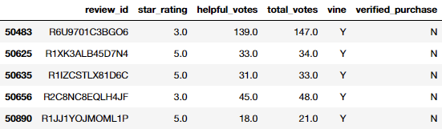
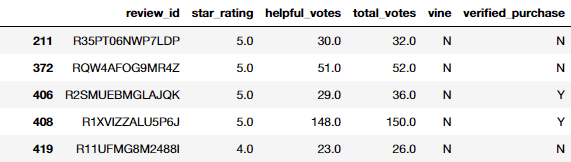

# Amazon Vine Review Analysis

## Challenge - Overview

In this module we look at Big Data and Natural Language Processing, with a slight dabble in Machine Learning. The context around the data analysis is that we are looking to understand how to understand product (or any type) reviews can be understood by a machine, that primarily deals in numerical values. In the module we also interact with Amazon Web Services, S3 Buckets, Spark and the Python version PySpark, SQL and pgAdmin, Google Colab, and have a brief look at Hadoop and MapReduce and their function in data science.

For NLP we took data, Tokenized it, Stop Word Removed it, Hashed it, and fed it into an IDF method (Term Frequency-Inverse Document Frequency Weight). All before fitting/training it to a Machine Learning model and running test data through it. We understood these concepts individually, and then worked to add each step to a **Data Pipeline** in PySpark.

For the challenge we needed to take one of fifty different review datasets to run analysis on. We were given a list of Amazon review datasets, containing both paid and unpaid reviews, split into different categories - dataset list found [here](https://s3.amazonaws.com/amazon-reviews-pds/tsv/index.txt). We needed to pick a dataset, I chose the [Apparel](https://s3.amazonaws.com/amazon-reviews-pds/tsv/amazon_reviews_us_Apparel_v1_00.tsv.gz) one, and we would begin our analysis.

Once we had our chosen dataset, we would first use PySpark to perform the Extract-Transform-Load process on it. Then we would connect to an AWS RDS instance, and load the transformed data into pgAdmin. This would be done in Google Colab by installing PySpark and the driver that works with PostgreSQL. Once we had created our needed tables for analysis, we exported the `vine_table` table to a CSV file, to breakdown. In Jupyter Notebook we used `Pandas` to split the data up further, and finally, determine if there was any bias toward the rating of the review, based on whether it was a paid (`vine == 'Y'`) review or not.

## Challenge - Results

In Google Colab ([Amazon Reviews ETL](Amazon_Reviews_ETL.ipynb)) we transformed the original dataset to create a new DataFrame that we called `vine_df`, which looked like:

```python
vine_df = df.select(['review_id', 'star_rating', 'helpful_votes', 'total_votes', 'vine', 'verified_purchase'])
```

And using a connection to our Amazon Web Service PostgreSQL database, we wrote the DataFrame to a table with:

```python
vine_df.write.jdbc(url=jdbc_url, table='vine_table', mode=mode, properties=config)
```

Once the data was in our database, we used the pgAdmin export function to export the table `vine_table` to a CSV file - this is in our repo, `vine_table.csv`. We then read in the CSV to a new notebook ([Vine Review Analysis](Vine_Review_Analysis.ipynb)) and use Pandas to perform more analysis on the dataset. We clean the data by first only keeping reviews with `total_votes >= 20`:

```python
# Retrieve all rows where: total_votes count >= 20.
total_df = df.loc[df['total_votes'] >= 20]
```

And then only reviews that have a `helpful` rating above `50%`:

```python
# Retrieve all rows where: helpful_votes / total_votes >= 50%.
helpful_df = total_df.loc[df['helpful_votes'] / df['total_votes'] >= 0.5]
```

Then we create a new DataFrame to hold all the paid (`vine == 'Y'`) reviews:

```python
# Retrieve all rows where: vine == 'Y'  - (paid).
paid_df = helpful_df.loc[df['vine'] == 'Y']
```

Which makes the DataFrame:



And also, a DataFrame to hold all the unpaid (`vine == 'N'`) reviews:

```python
# Retrieve all rows where: vine == 'Y'  - (paid).
unpaid_df = helpful_df.loc[df['vine'] == 'N']
```

Which makes the DataFrame:



With this available data we can answer the following questions:

* **How many Vine reviews and non-Vine reviews were there?**

We can find this with:

```python
# PAID - total number of reviews.
print(f"Total number of paid reviews is {len(paid_df)}.")
# UNPAID - total number of reviews.
print(f"Total number of unpaid reviews is {len(unpaid_df)}.")
```

Which gives us the output:

* Total number of paid reviews is **33**.
* Total number of unpaid reviews is **45388**.

* **How many Vine reviews were 5 stars? How many non-Vine reviews were 5 stars?**

To answer this question:

```python
# PAID - total number of 5-star reviews.
print(f"Total number of paid 5-star reviews is {len(paid_df.loc[paid_df['star_rating'] == 5.0])}.")
# UNPAID - total number of 5-star reviews.
print(f"Total number of unpaid 5-star reviews is {len(unpaid_df.loc[unpaid_df['star_rating'] == 5.0])}.")
```

Giving the output:

* Total number of paid 5-star reviews is **15**.
* Total number of unpaid 5-star reviews is **23733**.

* **What percentage of Vine reviews were 5 stars? What percentage of non-Vine reviews were 5 stars?**

And finally, we answer this question with:

```python
# PAID - percentage of 5-star reviews.
print(f"The percentage of paid 5-star reviews is {(len(paid_df.loc[paid_df['star_rating'] == 5.0]) / len(paid_df)) * 100:.2f}%.")
# UNPAID - percentage of 5-star reviews.
print(f"The percentage of unpaid 5-star reviews is {(len(unpaid_df.loc[unpaid_df['star_rating'] == 5.0]) / len(unpaid_df)) * 100:.2f}%.")
```

To give us the output:

* The percentage of paid 5-star reviews is **45.45%**.
* The percentage of unpaid 5-star reviews is **52.29%**.

## Challenge - Summary

From the percentages returned from the last question in the results, we can see that paid reviews tend to give positive reviews 45% of the time, and unpaid reviews 52% of the time. This is only a 7% difference, from a very small sample size of paid reviews (especially compared to the number of unpaid reviews), so I would say there was **no bias for reviews in the Vine program**. Certainly **not positivity bias** at least, as the positivity rate is lower than that of the unpaid reviews. You would need more paid reviews in this category to compare with the unpaid ones to look for bias.

To gain more insight into our data we could perform other statistical tests from previous modules, most notable Module 15. To continue to see if there is a positivity bias, we could run a two-sample t-test to compare the two datasets, and see if there exists a statistical difference between the two samples.

To do this we would form our hypotheses and decide upon the standard significance level of `0.05`.

* H<sub>0</sub> - there is **no statistical difference** between the two observed sample means.
*	H<sub>a</sub> – there is **a statistical difference** between the two observed sample means.

We would split our filtered data in the same way as Deliverable 2, and creating a paid and unpaid DataFrame:

```python
# Get same paid and unpaid tables from Deliverable 2.
filtered_df = df.loc[(df['total_votes'] >= 20) & (df['helpful_votes'] / df['total_votes'] >= 0.5)]
paid_df = filtered_df.loc[df['vine'] == 'Y']
unpaid_df = filtered_df.loc[df['vine'] == 'N']
```

And import the t-test method from the SciPy module, passing in the `star_rating` column each new DataFrame:

```python
from scipy.stats import ttest_ind
ttest_ind(paid_df['star_rating'], unpaid_df['star_rating'])
```

Which outputs:

```
Ttest_indResult(statistic=0.8728524952522342, pvalue=0.3827480965398675)
```

Showing a **p-value of 0.382** - meaning we are unable to reject the null hypothesis and must state there is no significant difference between the sample means. This is more proof that supports our statement of there being ***no positivity bias in the paid reviews***.

## Context

This is the Challenge Repo for Module 16 of the University of Toronto School of Continuing Studies Data Analysis Bootcamp Course - **Big Data and NLP** - PySpark, Machine Learning, NLP, and Data Interactions. Following the guidance of the module we end up pushing this selection of files to GitHub.
